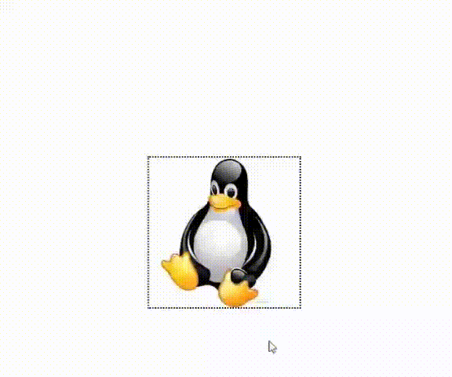

# Dar zoom na imagem

Descrição:  
Como fazer a imagem dar zoom quando passa o mouse em cima e tirar zoom quando mouse sair de cima dela.
 
Arquivos:  
index.html = é o arquivo html;  
style.css = é o arquivo com o estilo;  
script.js = é o arquivo com o JavaScript.  
 
 Exibindo zoom:  
 

Criado por: Breno Cardoso;  
Github user: BrenoCardoso2002;  
LinkedIn: breno-bernardo-da-silva-cardoso. 
